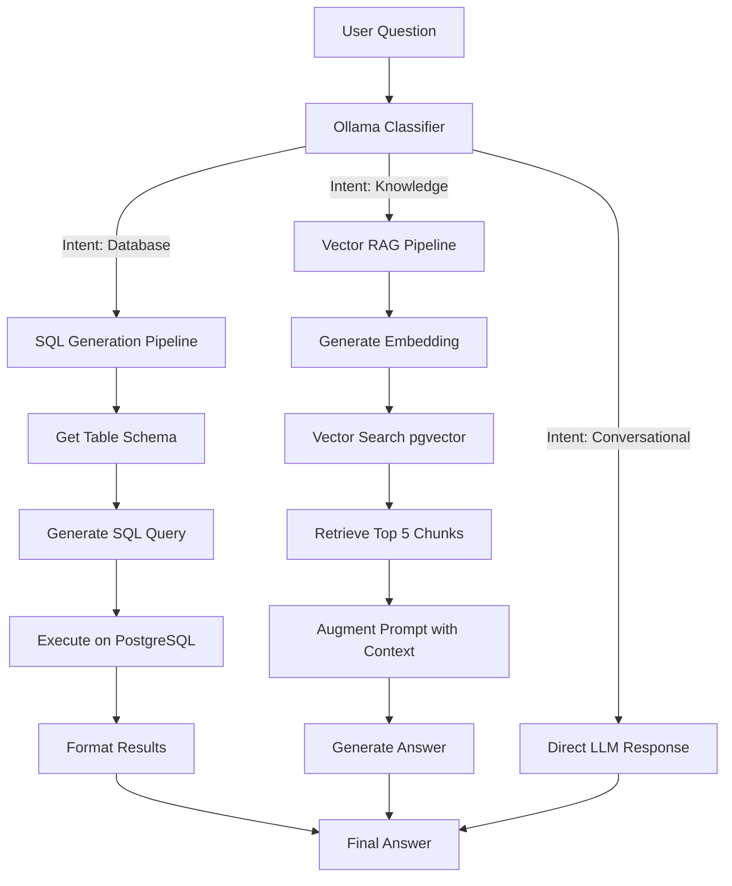

# Hybrid RAG System Flow

## 🔄 High-Level Architecture

The system uses a **Hybrid Routing** mechanism to decide how to answer a user's question. It doesn't just treat everything as a vector search; it intelligently distinguishes between questions that need **SQL** (exact data) and questions that need **Semantic Search** (documents).



---

## 🛠️ Detailed Pipeline Steps

### 1. Classification Phase
**Input:** User's raw question (e.g., "How many people survived?").
**Process:**
- The system sends a prompt to `gemma3:1b`.
- Prompt: "Classify this question into: `database`, `knowledge`, `conversational`, or `irrelevant`."
- **Output:** A single keyword (e.g., `database`).

### 2. Execution Phase (Branching)

#### ➤ Branch A: Database (Structured Data)
*Used for: Titanic dataset, statistics, counts.*
1.  **Schema Loading:** The system loads the schema of the `titanic` table.
2.  **SQL Generation:**
    -   **Model:** `gemma3:1b`
    -   **Prompt:** "Translate '{question}' into a PostgreSQL query for table `titanic`..."
3.  **Sanitization:** The generated SQL is stripped of markdown and dangerous keywords (`DROP`, `DELETE`).
4.  **Execution:** The query runs against the local PostgreSQL database.
5.  **Formatting:** The raw rows (e.g., `[(342,)]`) are converted into a sentence ("342 passengers survived").

#### ➤ Branch B: Knowledge (Unstructured Data)
*Used for: Company Policy, rules, text documents.*
1.  **Embedding:**
    -   **Model:** `nomic-embed-text`
    -   **Input:** User question.
    -   **Output:** 768-dimensional vector.
2.  **Retrieval:**
    -   **Query:** `SELECT content FROM documents ORDER BY embedding <=> query_vector LIMIT 5`
    -   **Result:** The 5 most relevant text paragraphs from the PDF.
3.  **Generation:**
    -   **Context:** The retrieved paragraphs are pasted into the system prompt.
    -   **Prompt:** "Answer the question using ONLY the context below..."
    -   **Output:** A natural language answer based on the PDF.

#### ➤ Branch C: Conversational
*Used for: Greetings, thanks, small talk.*
1.  **Direct Response:** The LLM generates a polite, contextual reply without accessing the database.

---

## 📊 Data Flow Diagram

```
User Input
   │
   ▼
[Backend API] ───► [Ollama Service]
                        │
                        ▼
                  [Intent Classifier]
                   │       │       │
        ┌──────────┘       │       └──────────┐
        ▼                  ▼                  ▼
   [SQL Pipeline]    [RAG Pipeline]    [Chat Pipeline]
        │                  │                  │
   [PostgreSQL]       [pgvector]              │
   (Titanic Table)    (Documents Table)       │
        │                  │                  │
        └──────────┐       │       ┌──────────┘
                   ▼       ▼       ▼
                  [Response Formatter]
                           │
                           ▼
                     [Frontend UI]
```

---

## ⚡ Performance Metrics
- **Classification:** ~200ms
- **Vector Search:** ~50ms
- **SQL Execution:** ~10ms
- **LLM Generation:** ~1-3 seconds (depending on hardware)